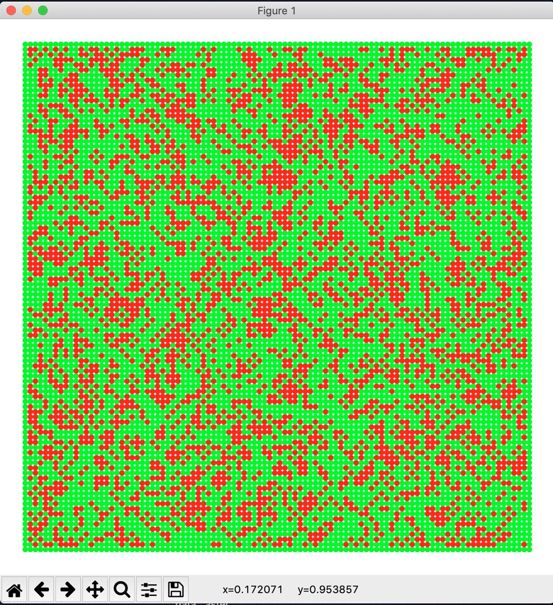

# 2D-Cellular-Automaton
**~~Under Development~\~**

Simulation and visualisation in matplotlib of 2d cellular automatons.

## Overview 
Check out the Wikipedia [article](https://en.wikipedia.org/wiki/Cellular_automaton) about cellular automaton.
With this module you could: (TODO: add images)
- **configure** your automaton
- **explore** properties
- **visualise** them
- **save** as gif
- **analyse** results, build reports 

## Configurations

#### Lattice types:
- rectangular
- triangular
- hexagonal

#### Boundary relation (induce "shape" of simulation surface):
- flat square
- cylinder
- Moebius strip
- torus
- Kleine bottle
- sphere

#### Neighbourhood types (for square lattice):
- Von Neunman neigbourhood
- Moore neigbourhood

#### Possible rules:
- classical
- custom

## Installation

## Examples of usage:
`python experiment.py -id 1`

Randomly initialised 100x100 grid will look like:
 
